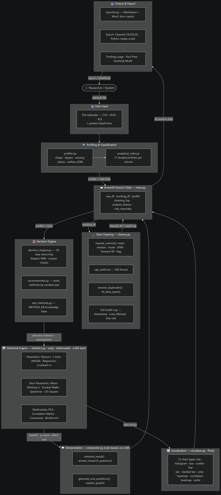

# 🔬 AI Research Analyst

**A No-Code Research Data Analytics Platform built with Python and Streamlit.**

---

## Project Overview

AI Research Analyst is a fully self-contained, browser-based analytics platform that lets researchers, students, and data practitioners explore, clean, analyse, and report on research datasets — all without writing a single line of code.

The platform guides users from raw data upload through to a polished, downloadable research report. Every statistical result is accompanied by a plain-language interpretation, method justification, assumption checks, and an effect-size estimate, making it suitable for academic and applied research contexts.

---

## Problem Statement

Researchers without programming expertise often struggle to:

- Choose the statistically appropriate method for their research question and data type.
- Correctly interpret output from statistical software.
- Detect and handle data quality issues (missing values, outliers, type mismatches) before analysis.
- Produce well-structured, publication-ready reports efficiently.

Existing tools either require coding knowledge (Python, R) or are expensive commercial packages. AI Research Analyst addresses this gap with a free, open-source, no-code solution.

---
## Objectives

1. Provide automated variable classification and analytical role assignment for any uploaded dataset.
2. Offer guided, assumption-checked statistical analysis covering both parametric and non-parametric methods.
3. Automatically recommend the most appropriate statistical test based on the data and research question.
4. Generate plain-language interpretations of all statistical results (no invented values).
5. Support interactive data cleaning with full audit logging.
6. Enable students to prepare for viva examinations through AI-generated questions and guided answers.
7. Produce downloadable Word (`.docx`) research reports.
8. Require no API keys, cloud services, or external dependencies of any kind.

---
## System Architecture



## System Approach

The platform follows a **pipeline architecture**:

```
Upload → Profile → Clean → Classify → Analyse → Interpret → Visualise → Report
```

Each step is isolated in its own engine module. The Streamlit front-end orchestrates the pipeline through session state, ensuring that cleaning operations, role overrides, and analysis history persist across pages within a session.

The "AI" layer consists entirely of **rule-based and template-driven interpretation** implemented in `engine/interpreter.py` and `engine/decision_engine.py`. There are no calls to any LLM, cloud AI service, or external API. All computation runs locally.

---

## System Architecture

```
research_analytics/
│
├── main.py                      ← Streamlit entry point (single-file UI)
├── requirements.txt             ← Python dependencies
├── .streamlit/
│   └── config.toml              ← Theme, palette, Streamlit settings
│
└── engine/                      ← Core analytics engine (pure Python)
    ├── __init__.py
    ├── profiler.py              ← Dataset profiling and variable-type detection
    ├── analytical_roles.py      ← Variable classification (11 analytical roles)
    ├── cleaner.py               ← Missing-value imputation, outlier capping,
    │                               duplicate removal, type fixing
    ├── statistics.py            ← 30+ statistical tests and computations
    ├── stat_methods.py          ← Statistical method knowledge base
    ├── decision_engine.py       ← Automated test selection and assumption checking
    ├── recommender.py           ← Method recommendation per variable pair
    ├── interpreter.py           ← Plain-language result interpretation,
    │                               research-question answering, viva Q&A
    ├── visualizer.py            ← Plotly chart builders (12 chart types)
    └── reporter.py              ← Markdown and Word (.docx) report generation
```

---

## Project Workflow

```
1. Upload Data
   └─ CSV, Excel (.xlsx / .xls) accepted

2. Data Overview
   └─ Shape, column types, missing-value summary, descriptive statistics,
      data preview

3. Variable Classification
   └─ Automated analytical-role assignment (11 roles)
   └─ Researcher override of any variable's role

4. Data Cleaning
   └─ Missing-value imputation (mean, median, mode, KNN, forward-fill, flag)
   └─ Outlier detection and IQR-based capping
   └─ Duplicate row removal
   └─ Category standardisation and data-type conversion
   └─ Full audit log with undo support

5. Statistical Analysis
   └─ Guided wizard: pick variables → engine selects test → checks assumptions
      → runs test → interprets result
   └─ Manual override available

6. Visual Analysis
   └─ 12 Plotly chart types with auto-recommendation by variable roles

7. AI Research Assistant
   └─ Natural-language research question → automatic analysis → interpreted answer

8. Viva Preparation
   └─ Generates examination questions from the session's analysis history

9. Findings
   └─ Aggregated summary of all completed analyses

10. Research Report
    └─ Auto-generated Markdown report + downloadable Word (.docx)

11. Export
    └─ Cleaned dataset as CSV or Excel
    └─ Python script replay (reproducible code export)

12. Teaching Mode
    └─ Conceptual explanations of statistical methods
```

---

## Multi-Agent System

> **Note:** This project does **not** implement a multi-agent system in the LLM/AI-agent sense.

The platform uses a **multi-engine pipeline** where specialised modules act as independent analytical agents:

| Engine Module | Role |
|---|---|
| `profiler.py` | Dataset profiling agent — detects types, computes summaries |
| `analytical_roles.py` | Classification agent — assigns 11 analytical roles per variable |
| `decision_engine.py` | Decision agent — selects the correct statistical test |
| `recommender.py` | Recommendation agent — ranks methods per variable pair |
| `statistics.py` | Computation agent — executes tests via scipy / statsmodels |
| `interpreter.py` | Interpretation agent — produces plain-language explanations |
| `visualizer.py` | Visualisation agent — builds appropriate Plotly charts |
| `cleaner.py` | Cleaning agent — handles imputation and quality issues |
| `reporter.py` | Reporting agent — compiles findings into documents |

Each engine module is stateless and independently testable. The Streamlit front-end in `main.py` orchestrates these modules through session state.

---

## Tech Stack

| Layer | Technology |
|---|---|
| UI framework | [Streamlit](https://streamlit.io/) ≥ 1.35 |
| Data manipulation | [pandas](https://pandas.pydata.org/) ≥ 2.0 |
| Numerical computing | [NumPy](https://numpy.org/) ≥ 1.24 |
| Statistical tests | [SciPy](https://scipy.org/) ≥ 1.11 |
| Advanced statistics | [statsmodels](https://www.statsmodels.org/) ≥ 0.14 |
| Machine learning | [scikit-learn](https://scikit-learn.org/) ≥ 1.3 (PCA, KNN imputation) |
| Visualisation | [Plotly](https://plotly.com/python/) ≥ 5.20 |
| Excel I/O | [openpyxl](https://openpyxl.readthedocs.io/) ≥ 3.1, [xlrd](https://xlrd.readthedocs.io/) ≥ 2.0 |
| Report export | [python-docx](https://python-docx.readthedocs.io/) ≥ 1.1 |
| Language | Python 3.9+ |

---

## Key Features

- **No-code interface** — every step accessible through point-and-click UI
- **Automated variable classification** — 11 analytical roles (substantive numerical, categorical, ordinal, boolean, identifier, serial, administrative code, constant, datetime, free text, unknown)
- **Guided statistical analysis** — engine selects the appropriate test automatically
- **Assumption checking** — normality (Shapiro-Wilk, D'Agostino-Pearson), homogeneity of variance (Levene), sample-size guidance
- **Effect size computation** — Cohen's d, η², Cramér's V, r, ω² with confidence intervals
- **Plain-language interpretation** — every result explained in non-technical prose
- **Research question answering** — enter a natural-language question; the engine selects and runs the relevant test
- **Viva preparation module** — auto-generated examination questions from session analysis history
- **Interactive data cleaning** — full audit log, per-column imputation method selection
- **12 chart types** — bar, frequency bar, pie/donut, histogram, box plot, scatter, line, stacked bar, area, heatmap, correlation heatmap, violin
- **Downloadable Word report** — structured `.docx` research report
- **Python code export** — reproducible script generated from session analyses
- **Teaching mode** — conceptual explanations of statistical methods
- **Fully offline** — no internet connection, API keys, or cloud services required

---

## Statistical Methods

### Parametric Tests
| Method | Function |
|---|---|
| Pearson Correlation | `pearson_correlation` |
| Independent Samples t-test (Welch) | `independent_ttest` |
| Paired Samples t-test | `paired_ttest` |
| One-Way ANOVA + Tukey HSD post-hoc | `one_way_anova` |
| Welch ANOVA | `welch_anova_test` |
| Simple & Multiple Linear Regression | `linear_regression` |
| Binary Logistic Regression | `logistic_regression` |
| Cronbach's Alpha (reliability) | `cronbach_alpha` |
| Point-Biserial Correlation | `point_biserial_correlation` |

### Non-Parametric Tests
| Method | Function |
|---|---|
| Mann-Whitney U Test | `mann_whitney_u_test` |
| Wilcoxon Signed-Rank Test | `wilcoxon_signed_rank_test` |
| Kruskal-Wallis Test + Dunn post-hoc | `kruskal_wallis_test` |
| Friedman Test | `friedman_test` |
| Spearman Rank Correlation | `spearman_correlation` |
| Kendall's Tau | `kendall_correlation` |
| Fisher's Exact Test | `fishers_exact_test` |
| Chi-Square Test of Independence | `chi_square_test` |
| Chi-Square Goodness-of-Fit | `chi_square_goodness_of_fit` |

### Assumption & Diagnostic Tests
| Method | Function |
|---|---|
| Shapiro-Wilk / D'Agostino-Pearson Normality | `normality_check` |
| Levene's Test of Homogeneity | `levene_test` |
| Chi-Square Expected-Cell Check | `chi_square_expected_check` |
| Five-Number Summary | `five_number_summary` |
| Central Tendency Recommendation | `central_tendency_recommendation` |

### Multivariate / Advanced
| Method | Function |
|---|---|
| Principal Component Analysis (PCA) | `pca_analysis` |
| Correlation Matrix (Pearson/Spearman/Kendall) | `correlation_matrix` |
| Covariance | `covariance` |

### Multiple Testing Correction
| Method | Function |
|---|---|
| Bonferroni Correction | `bonferroni_correction` |
| Holm-Bonferroni Correction | `holm_bonferroni_correction` |

---

## Quick Start

### Prerequisites

- Python 3.9 or higher
- pip

### 1. Clone the repository

```bash
git clone https://github.com/<your-username>/<your-repo>.git
cd <your-repo>
```

### 2. Create and activate a virtual environment (recommended)

```bash
# Windows
python -m venv .venv
.venv\Scripts\activate

# macOS / Linux
python -m venv .venv
source .venv/bin/activate
```

### 3. Install dependencies

```bash
pip install -r requirements.txt
```

### 4. Run the dashboard

```bash
streamlit run main.py
```

The dashboard will open automatically at `http://localhost:8501`.

> **Note:** Run the command from inside the `research_analytics/` directory, or adjust the path accordingly:
> ```bash
> streamlit run research_analytics/main.py
> ```

---

## Streamlit Community Cloud Deployment

1. Push this repository to GitHub.
2. Go to [share.streamlit.io](https://share.streamlit.io) and click **New app**.
3. Set:
   - **Repository:** `<your-username>/<your-repo>`
   - **Branch:** `main`
   - **Main file path:** `research_analytics/main.py`
4. Click **Deploy**.

**No secrets or environment variables are required.** The application has no API keys, tokens, or external service dependencies.

---

## Project File Structure

```
research_analytics/
├── main.py                  ← Streamlit entry point — run this file
├── requirements.txt         ← Python package dependencies
├── README.md                ← This file
├── .gitignore               ← Files excluded from version control
├── .streamlit/
│   └── config.toml          ← Streamlit theme and browser settings
└── engine/
    ├── __init__.py
    ├── profiler.py
    ├── analytical_roles.py
    ├── cleaner.py
    ├── statistics.py
    ├── stat_methods.py
    ├── decision_engine.py
    ├── recommender.py
    ├── interpreter.py
    ├── visualizer.py
    └── reporter.py
```

---

## Limitations

- **Session-based only** — analysis history and cleaning log are lost when the browser tab is closed or the session resets. There is no persistent database.
- **In-memory processing** — very large datasets (> ~500 MB) may exhaust available RAM depending on the deployment environment.
- **No user authentication** — the platform is single-user per Streamlit session. It is not designed as a multi-user web application.
- **Interpretation is rule-based** — plain-language outputs are generated from templates and heuristics, not from a large language model. Complex or ambiguous datasets may receive generic interpretations.
- **Report export is Word only** — PDF export is not currently supported.
- **No longitudinal / time-series analysis** — while datetime columns are detected and classified, dedicated time-series models (ARIMA, etc.) are not implemented.

---

## Future Scope

- [ ] Persistent session storage (SQLite or cloud bucket) for saving and reloading analysis sessions
- [ ] PDF report export
- [ ] Additional statistical methods: factor analysis, structural equation modelling, survival analysis
- [ ] Support for SPSS `.sav` and Stata `.dta` file formats
- [ ] Multi-user authentication and project workspaces
- [ ] Integration with an LLM API (optional, opt-in) for richer free-text interpretation
- [ ] Interactive tutorial/onboarding walkthrough for first-time users
- [ ] Batch analysis across multiple datasets

---

## Secrets / API Keys Required

**None.** This project is entirely self-contained and requires no API keys, tokens, passwords, or environment variables of any kind. It can be deployed to Streamlit Community Cloud directly from GitHub with no additional configuration.

---

## License

This project is open-source. See `LICENSE` for details (add a `LICENSE` file if publishing publicly).
